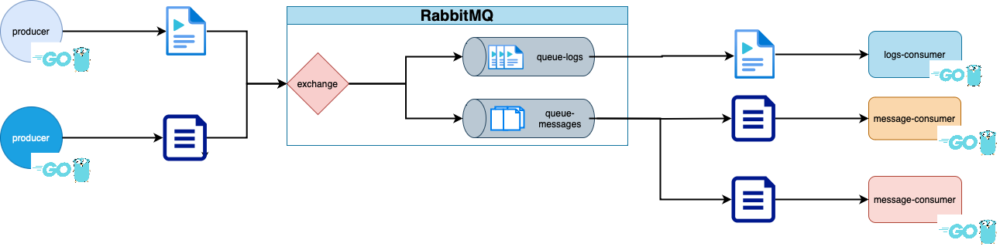

# Publisher/Subscriber com RabbitMQ

Esse projeto tem como objetivo implementar os conceitos de pub/sub em sistemas distribuídos.Para isso vamos utilizar o message broker RabbitMQ
### Stack:

- Golang
- RabbitMQ

### Overview
Vamos criar duas filas de mensagens em uma instância do RabbitMQ, além de um publicador(produtor) e dois assinantes(consumidores), sendo um para cada fila.

O RabbitMQ usa "exchanges" para rotear mensagens para as filas apropriadas. Existem diferentes tipos de exchanges (direct, topic, fanout, headers), cada uma com sua própria lógica de roteamento.

- **Direct Exchange**: Roteia mensagens com base em uma chave de roteamento exata.
- **Topic Exchange**: Usa padrões de chave de roteamento para rotear mensagens.
- **Fanout Exchange**: Roteia mensagens para todas as filas ligadas a ela, sem considerar a chave de roteamento.
- **Headers Exchange**: Usa os atributos das mensagens (headers) para decidir para qual fila enviar.

Para nosso projeto utilizaremos o padrão “topic”, onde direcionará as mensagens para duas filas de mensagens, local que ficarão armazenadas até serem consumidas por algum assinante.

<p align="center">
  
</p>


### Execução

Todo nosso ambiente será executado em **docker**, onde através de um arquivo docker-compose subiremos todo o ambiente, que consiste nos seguinte componentes:

- Uma instância RabbbitMQ
- Uma instância de publisher
- Tres instância de subscribers

```yaml
version: '3.8'

services:
  publisher:
    image: leocrispindev/pubsubrabbitmq-publisher:v0.0.5
    container_name: publisher
    environment:
      - BROKER_HOST=broker
    depends_on:
      - rabbitmq
    networks:
        default:
          aliases:
            - publisher
  rabbitmq:
    image: rabbitmq:3-management
    container_name: rabbitmq
    hostname: broker
    ports:
      - "5672:5672" 
      - "15672:15672"
    environment:
      RABBITMQ_DEFAULT_USER: userguest
      RABBITMQ_DEFAULT_PASS: user123
    networks:
        default:
          aliases:
            - broker
    volumes:
      - rabbitmq_data:/var/lib/rabbitmq

  subscriber_messages:
    image: leocrispindev/pubsubrabbitmq-subscriber:v0.0.1
    command: ["./subscriber", "queue_messages"]
    container_name: subscriber_messages_01
    environment:
      - BROKER_HOST=broker
    depends_on:
      - rabbitmq
      - publisher

  subscriber_messages2:
    image: leocrispindev/pubsubrabbitmq-subscriber:v0.0.1
    command: ["./subscriber", "queue_messages"]
    container_name: subscriber_messages_02
    environment:
      - BROKER_HOST=broker
    depends_on:
      - rabbitmq
      - publisher
  
  subscriber_logs:
    image: leocrispindev/pubsubrabbitmq-subscriber:v0.0.1
    command: ["./subscriber", "queue_logs"]
    container_name: subscriber_logs
    environment:
      - BROKER_HOST=broker
    depends_on:
      - rabbitmq
      - publisher

volumes:
  rabbitmq_data:
    driver: local

networks:
  default:
    driver: bridge
    name: pub-sub-rabbitmq

```

### Referências

RabbitMQ: https://www.rabbitmq.com/